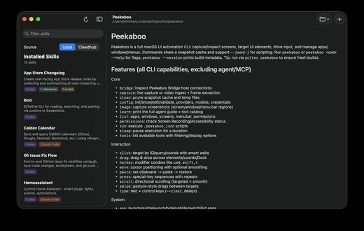
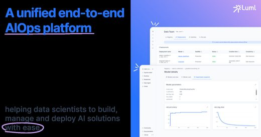
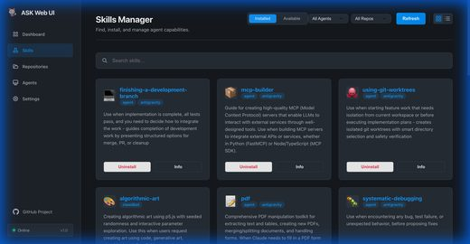
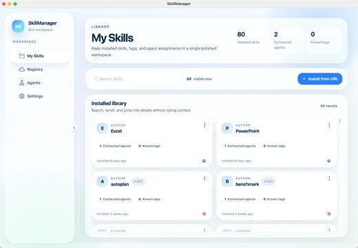

# Awesome Agent Skills Managers

[中文](README.zh-CN.md)

Open-source tools to **find, install, sync and organize agent skills** across Claude Code, Codex, Cursor and other coding agents: CLI installers, desktop apps, registries, team tools. 177 repos, each one read and security-graded by [Agent Skills Hub](https://agentskillshub.top?utm_source=github&utm_medium=awesome-list).

Live page with filters: **[https://agentskillshub.top/best/skill-management-tools/](https://agentskillshub.top/best/skill-management-tools/?utm_source=github&utm_medium=awesome-list)** · refreshed every 8 hours

## What these managers look like

<table>
<tr>
<td align="center" valign="top" width="33%"><b>🧱 All-in-one Claude skills managers</b> 27 repos   Managers of whole agent setups: skills, MCP servers, prompts and settings. <a href="#type-general"><b>View the list →</b></a></td>
<td align="center" valign="top" width="33%"><b>⌨️ Claude skills CLI installers</b> 54 repos   Add, remove and update skills from a terminal. <a href="#type-cli"><b>View the list →</b></a></td>
<td align="center" valign="top" width="33%"><b>🔄 Claude skills sync across agents</b> 9 repos  One skill folder shared by several agents or machines. <a href="#type-sync"><b>View the list →</b></a></td>
</tr>
<tr>
<td align="center" valign="top" width="33%"><b>🖥 Claude skills manager apps</b> 45 repos   Desktop, web and TUI apps to browse and manage skills. <a href="#type-app"><b>View the list →</b></a></td>
<td align="center" valign="top" width="33%"><b>🔎 Claude skills registries & marketplaces</b> 37 repos  Registries, marketplaces and search engines for skills. <a href="#type-registry"><b>View the list →</b></a></td>
<td align="center" valign="top" width="33%"><b>👥 Team Claude skills management</b> 5 repos  Sharing, versioning and permissions across a team. <a href="#type-team"><b>View the list →</b></a></td>
</tr>
</table>

## Contents

- [🧪 Tested end to end](#tested)
- [🧱 All-in-one Claude skills managers](#type-general) (27)
- [⌨️ Claude skills CLI installers](#type-cli) (54)
- [🔄 Claude skills sync across agents](#type-sync) (9)
- [🖥 Claude skills manager apps](#type-app) (45)
- [🔎 Claude skills registries & marketplaces](#type-registry) (37)
- [👥 Team Claude skills management](#type-team) (5)

## How a repo gets on the list

1. It manages agent skills or plugins: finds, installs, syncs, updates or shares them. One skill, or a collection of skills, is not a manager.
2. It is software someone can install or run, not a list of links or a placeholder.
3. It has a README. Without one it cannot be graded.
4. At 50 stars or more it is listed on topic alone. Under 50 it must also clear a README quality bar (shows it working, one-command start, a concrete outcome, complete docs), and have 5 stars.

The questions are answered by a decision model reading each README, not by hand. A repo near a cut-off can land on either side; open an issue if one is misfiled.

## 🧪 Tested end to end

On 2026-10-09 we ran 16 of these tools; 12 could be judged. Each got the same job in a throwaway sandbox, driven by Claude Code (Claude Opus 5.5): install 20 local skills, install one more that ships a `curl | sh` setup script, remove all but five, and give those five to Codex. What is on disk and how many tokens Claude Code loads were measured after each step.

**What we found:** only one of 12 stopped at the risky skill (asm, which declined by default); ten installed it with no warning. Context cost did not separate them: 345 to 396 more tokens per session for 20 skills, whatever the tool.

| Tool | ★ | Skill with a curl \| sh script | Removes cleanly | Syncs to Codex | +tokens per session (20 skills) | |
|---|---|---|---|---|---|---|
| [asm](https://github.com/luongnv89/asm) | 952 | warned, not installed by default | yes | yes | +345 | [evidence](https://agentskillshub.top/best-runs/skillmgr/luongnv89__asm.html) |
| [skillshare](https://github.com/runkids/skillshare) | 2,715 | warned, installed anyway | yes | yes | +382 | [evidence](https://agentskillshub.top/best-runs/skillmgr/runkids__skillshare.html) |
| [apm](https://github.com/microsoft/apm) | 3,954 | showed the source only, installed | yes | yes | +345 | [evidence](https://agentskillshub.top/best-runs/skillmgr/microsoft__apm.html) |
| [mcptoon](https://github.com/activeing123/mcptoon) | 214 | showed the source only, installed | yes | yes | +350 | [evidence](https://agentskillshub.top/best-runs/skillmgr/activeing123__mcptoon.html) |
| [kasetto](https://github.com/pivoshenko/kasetto) | 209 | showed the source only, installed | yes | yes | +345 | [evidence](https://agentskillshub.top/best-runs/skillmgr/pivoshenko__kasetto.html) |
| [agent-skills-cli](https://github.com/Karanjot786/agent-skills-cli) | 182 | showed the source only, installed | yes | yes | +345 | [evidence](https://agentskillshub.top/best-runs/skillmgr/Karanjot786__agent-skills-cli.html) |
| [skills-cli](https://github.com/dhruvwill/skills-cli) | 14 | showed the source only, installed | yes | yes | +345 | [evidence](https://agentskillshub.top/best-runs/skillmgr/dhruvwill__skills-cli.html) |
| [skillfile](https://github.com/eljulians/skillfile) | 173 | showed the source only, installed | no | yes | +349 | [evidence](https://agentskillshub.top/best-runs/skillmgr/eljulians__skillfile.html) |
| [ai-agent-skills](https://github.com/MoizIbnYousaf/ai-agent-skills) | 1,147 | installed without a word | yes | yes | +345 | [evidence](https://agentskillshub.top/best-runs/skillmgr/MoizIbnYousaf__ai-agent-skills.html) |
| [skill-flow](https://github.com/VintLin/skill-flow) | 262 | installed without a word | yes | only to installed agents | +345 | [evidence](https://agentskillshub.top/best-runs/skillmgr/VintLin__skill-flow.html) |
| [skills-management](https://github.com/nnnggel/skills-management) | 128 | installed without a word | yes | yes | +396 | [evidence](https://agentskillshub.top/best-runs/skillmgr/nnnggel__skills-management.html) |
| [agent-skill-sync](https://github.com/kina-cmd/agent-skill-sync) | 101 | installed without a word | no | yes | +345 | [evidence](https://agentskillshub.top/best-runs/skillmgr/kina-cmd__agent-skill-sync.html) |

**Ran, but this test could not judge them:** skillfish (Installs only from GitHub (owner/repo); the test skills were local folders, so install, prune and sync were not tested.); skills-link (Adds skills only from GitHub URLs; the test skills were local folders, so install, prune and sync were not tested.); capa (Installs per project (./.claude/skills), never globally; it installed, pruned and synced the project copy, which the home-folder measurement does not see.); skill-manager (Not an installer: a skill that analyses installed skills and lists the ones to disable in CLAUDE.md.)

[All results, prompts and scripts](https://github.com/zhuyansen/agent-skills-hub/blob/main/ops/skillmgr-runs/RESULTS.md) · [https://agentskillshub.top/best/skill-management-tools/#test-results](https://agentskillshub.top/best/skill-management-tools/?utm_source=github&utm_medium=awesome-list#test-results)

## 🧱 All-in-one Claude skills managers

[Open this type on the live page, sorted by stars →](https://agentskillshub.top/best/skill-management-tools/?utm_source=github&utm_medium=awesome-list#type-general)

<table><tr>
<td align="center" valign="top"> <a href="https://github.com/luml-ai/AGENTS.lock">luml-ai/AGENTS.lock</a></td>
</tr></table>

| Repo | Stars | What it does | Security |
|---|---:|---|---|
| [microsoft/apm](https://github.com/microsoft/apm) | 4.0k | Agent Package Manager | [SAFE](https://agentskillshub.top/skill/microsoft/apm/?utm_source=github&utm_medium=awesome-list) |
| [runkids/skillshare](https://github.com/runkids/skillshare) | 2.8k | 📚 Sync skills, agents, MCP, plugins to all AI CLI tools with one command and simplify team sharing. | [SAFE](https://agentskillshub.top/skill/runkids/skillshare/?utm_source=github&utm_medium=awesome-list) |
| [infragate/capa](https://github.com/infragate/capa) | 724 | One capabilities.yaml wires skills, tools, rules, sub-agents, MCP servers, and plugins into Cursor, Claude Code, Codex, Windsurf, GitHub Copilot, and… | [SAFE](https://agentskillshub.top/skill/infragate/capa/?utm_source=github&utm_medium=awesome-list) |
| [RealZST/HarnessKit](https://github.com/RealZST/HarnessKit) | 453 | More than a skill manager — manage skills, MCP servers, plugins, hooks, CLIs, configs, memory & rules across every AI coding agent. 🌟 Star if you lik… | [SAFE](https://agentskillshub.top/skill/RealZST/HarnessKit/?utm_source=github&utm_medium=awesome-list) |
| [pivoshenko/kasetto](https://github.com/pivoshenko/kasetto) | 209 | 📼 Declarative AI agent environment manager, written in Rust | [SAFE](https://agentskillshub.top/skill/pivoshenko/kasetto/?utm_source=github&utm_medium=awesome-list) |
| [sandbaseai/sandbase-skills](https://github.com/sandbaseai/sandbase-skills) | 202 | 88 installable open-source Agent Skills for research, social intelligence, marketing, and business workflows—compatible with Codex, Claude Code, Curs… | [SAFE](https://agentskillshub.top/skill/sandbaseai/sandbase-skills/?utm_source=github&utm_medium=awesome-list) |
| [pr-pm/prpm](https://github.com/pr-pm/prpm) | 122 | The universal registry for AI coding tools | [SAFE](https://agentskillshub.top/skill/pr-pm/prpm/?utm_source=github&utm_medium=awesome-list) |
| [vanillagreencom/kendex](https://github.com/vanillagreencom/kendex) | 83 | Package manager for agents, skills, hooks, and extensions. Author once, install on every harness. QOL features included. | [SAFE](https://agentskillshub.top/skill/vanillagreencom/kendex/?utm_source=github&utm_medium=awesome-list) |
| [mensfeld/craftdesk](https://github.com/mensfeld/craftdesk) | 67 | Package manager for Claude Code skills and agents and other AI related resources | [SAFE](https://agentskillshub.top/skill/mensfeld/craftdesk/?utm_source=github&utm_medium=awesome-list) |
| [itlackey/akm](https://github.com/itlackey/akm) | 60 | Agent Knowledge Manager (akm). A CLI tool to manage AI agent knowledge, memories, skills, and more. | [SAFE](https://agentskillshub.top/skill/itlackey/akm/?utm_source=github&utm_medium=awesome-list) |
| [egebese/skill-manager](https://github.com/egebese/skill-manager) | 38 | Save ~4,000 tokens per conversation by auto-disabling irrelevant Claude Code skills per project. Detects tech stack, scores skill relevance, injects… | [SAFE](https://agentskillshub.top/skill/egebese/skill-manager/?utm_source=github&utm_medium=awesome-list) |
| [GrubbyLee/skill-manager](https://github.com/GrubbyLee/skill-manager) | 29 | Zero-dependency CLI to scan, recommend, deduplicate, audit, and visualize Claude Code / Codex skills and MCP servers. | [SAFE](https://agentskillshub.top/skill/GrubbyLee/skill-manager/?utm_source=github&utm_medium=awesome-list) |
| [seed-forge/harness-ai-kit](https://github.com/seed-forge/harness-ai-kit) | 25 | Package manager for AI agent assets — 42 skills, 5 CLIs, 1 plugin. Skills for AI/LLM agent engineering, eval-driven dev, spec-driven dev, database (M… | [SAFE](https://agentskillshub.top/skill/seed-forge/harness-ai-kit/?utm_source=github&utm_medium=awesome-list) |
| [luml-ai/AGENTS.lock](https://github.com/luml-ai/AGENTS.lock) | 21 | A package manager for Agents/Skills/MCPs | [SAFE](https://agentskillshub.top/skill/luml-ai/AGENTS.lock/?utm_source=github&utm_medium=awesome-list) |
| [grimoire-rs/grimoire](https://github.com/grimoire-rs/grimoire) | 14 | Package manager for AI-agent config. grim installs, updates, and publishes skills, rules, agents, MCP servers, and bundles into Claude Code, Copilot,… | [SAFE](https://agentskillshub.top/skill/grimoire-rs/grimoire/?utm_source=github&utm_medium=awesome-list) |
| [barleviatias/toolkit-ai](https://github.com/barleviatias/toolkit-ai) | 12 | Package manager for AI coding assistants — manage skills, agents & MCPs across Claude Code, Codex, Copilot, and Cursor | [SAFE](https://agentskillshub.top/skill/barleviatias/toolkit-ai/?utm_source=github&utm_medium=awesome-list) |
| [xhyqaq/skill-manager](https://github.com/xhyqaq/skill-manager) | 9 | 用来解决 skills 管理问题 | [SAFE](https://agentskillshub.top/skill/xhyqaq/skill-manager/?utm_source=github&utm_medium=awesome-list) |
| [Brattlof/skillet](https://github.com/Brattlof/skillet) | 8 | Package manager for MCP servers, Agent Skills (SKILL.md), and Claude Code commands, hooks, subagents, and output styles. Installs into Claude Code, C… | [SAFE](https://agentskillshub.top/skill/Brattlof/skillet/?utm_source=github&utm_medium=awesome-list) |
| [kunaltulsidasani/claude-reimagined](https://github.com/kunaltulsidasani/claude-reimagined) | 8 | One-command bootstrap for a fully wired Claude Code workstation — installs Claude Code, RTK, context-mode, code-review-graph, caveman, hooks, MCP ser… | [SAFE](https://agentskillshub.top/skill/kunaltulsidasani/claude-reimagined/?utm_source=github&utm_medium=awesome-list) |
| [frmlabz/omnidev](https://github.com/frmlabz/omnidev) | 7 | A package manager for agentic coding capabilities. A universal way to discover, install, and manage commands, subagents, skills, and custom functiona… | [SAFE](https://agentskillshub.top/skill/frmlabz/omnidev/?utm_source=github&utm_medium=awesome-list) |
| [Asher-pro/skill-installer](https://github.com/Asher-pro/skill-installer) | 6 | Install any skill to Claude Code. | [SAFE](https://agentskillshub.top/skill/Asher-pro/skill-installer/?utm_source=github&utm_medium=awesome-list) |
| [CoderAndyLee/skills-manager](https://github.com/CoderAndyLee/skills-manager) | 6 | Safety-first inventory, audit, migration, deployment, and recovery for Agent Skills. | [SAFE](https://agentskillshub.top/skill/CoderAndyLee/skills-manager/?utm_source=github&utm_medium=awesome-list) |
| [VersoXBT/skill-manager](https://github.com/VersoXBT/skill-manager) | 6 | Claude Code plugin — inventory all your installed skills, check structure, and find updates. Free, zero dependencies. | [SAFE](https://agentskillshub.top/skill/VersoXBT/skill-manager/?utm_source=github&utm_medium=awesome-list) |
| [caioross/skilldepot-go](https://github.com/caioross/skilldepot-go) | 6 | Official Go SDK for SkillDepot - The AI Agent Skill Marketplace | [SAFE](https://agentskillshub.top/skill/caioross/skilldepot-go/?utm_source=github&utm_medium=awesome-list) |
| [lathe-cli/kitup](https://github.com/lathe-cli/kitup) | 6 | Shared installer SDK for bundled Agent Skills. | [SAFE](https://agentskillshub.top/skill/lathe-cli/kitup/?utm_source=github&utm_medium=awesome-list) |
| [robertoatila/jarvis-skill-registry](https://github.com/robertoatila/jarvis-skill-registry) | 6 | Local-first cognitive runtime for AI agents: bounded context, persistent memory, tool/model routing and verified execution. | [SAFE](https://agentskillshub.top/skill/robertoatila/jarvis-skill-registry/?utm_source=github&utm_medium=awesome-list) |
| [lonewolfyx/skills-config](https://github.com/lonewolfyx/skills-config) | 5 | Declarative Git skills manager for AI coding agents. Define skills in skills.config.ts and automatically provision them during npm install / prepare. | [SAFE](https://agentskillshub.top/skill/lonewolfyx/skills-config/?utm_source=github&utm_medium=awesome-list) |

## ⌨️ Claude skills CLI installers

[Open this type on the live page, sorted by stars →](https://agentskillshub.top/best/skill-management-tools/?utm_source=github&utm_medium=awesome-list#type-cli)

<table><tr>
<td align="center" valign="top"> <a href="https://github.com/yeasy/ask">yeasy/ask</a></td>
</tr></table>

| Repo | Stars | What it does | Security |
|---|---:|---|---|
| [MoizIbnYousaf/ai-agent-skills](https://github.com/MoizIbnYousaf/ai-agent-skills) | 1.1k | Universal skill installer and package manager for AI coding agents. One command, 12+ runtimes. npx ai-agent-skills | [SAFE](https://agentskillshub.top/skill/MoizIbnYousaf/ai-agent-skills/?utm_source=github&utm_medium=awesome-list) |
| [pathintegral-institute/mcpm.sh](https://github.com/pathintegral-institute/mcpm.sh) | 1.0k | CLI MCP package manager & registry for all platforms and all clients. Search & configure MCP servers. Advanced Router & Profile features. | [SAFE](https://agentskillshub.top/skill/pathintegral-institute/mcpm.sh/?utm_source=github&utm_medium=awesome-list) |
| [luongnv89/asm](https://github.com/luongnv89/asm) | 954 | The universal skill manager for AI coding agents. | [SAFE](https://agentskillshub.top/skill/luongnv89/asm/?utm_source=github&utm_medium=awesome-list) |
| [knoxgraeme/skillfish](https://github.com/knoxgraeme/skillfish) | 323 | The skill manager for AI coding agents. Install, update, and sync skills across Claude Code, Cursor, Copilot + more. | [SAFE](https://agentskillshub.top/skill/knoxgraeme/skillfish/?utm_source=github&utm_medium=awesome-list) |
| [VintLin/skill-flow](https://github.com/VintLin/skill-flow) | 262 | Install, manage, and share skills across every major coding agent — Claude Code, Cursor, Copilot, and more. | [SAFE](https://agentskillshub.top/skill/VintLin/skill-flow/?utm_source=github&utm_medium=awesome-list) |
| [activeing123/mcptoon](https://github.com/activeing123/mcptoon) | 216 | One zero-dependency CLI for every MCP server and agent skill. Token optimization, tool discovery and context compression: 71,929 -> 581 tokens (-99.2… | [SAFE](https://agentskillshub.top/skill/activeing123/mcptoon/?utm_source=github&utm_medium=awesome-list) |
| [shenysun/skills-manager](https://github.com/shenysun/skills-manager) | 197 |  | [SAFE](https://agentskillshub.top/skill/shenysun/skills-manager/?utm_source=github&utm_medium=awesome-list) |
| [Karanjot786/agent-skills-cli](https://github.com/Karanjot786/agent-skills-cli) | 182 | Universal CLI for Agent Skills. Access 200,000+ skills from SkillsMP and sync them to Cursor, Claude Code, GitHub Copilot, OpenAI Codex, and Antigrav… | [SAFE](https://agentskillshub.top/skill/Karanjot786/agent-skills-cli/?utm_source=github&utm_medium=awesome-list) |
| [eljulians/skillfile](https://github.com/eljulians/skillfile) | 174 | One-stop shop for AI skills and agents. Search 110K+ community skills, install and track them declaratively, and deploy across all major AI coding to… | [SAFE](https://agentskillshub.top/skill/eljulians/skillfile/?utm_source=github&utm_medium=awesome-list) |
| [LobsterTrap/lola](https://github.com/LobsterTrap/lola) | 131 | Lola is able to package AI Context Modules or skills into a distributed package to be supported across multiple AI assistants. Think of your skill as… | [SAFE](https://agentskillshub.top/skill/LobsterTrap/lola/?utm_source=github&utm_medium=awesome-list) |
| [Soul-Brews-Studio/arra-oracle-skills-cli](https://github.com/Soul-Brews-Studio/arra-oracle-skills-cli) | 123 | Install Oracle skills to Claude Code, OpenCode, Cursor, and 12+ AI coding agents | [SAFE](https://agentskillshub.top/skill/Soul-Brews-Studio/arra-oracle-skills-cli/?utm_source=github&utm_medium=awesome-list) |
| [jacob-bd/universal-skills-manager](https://github.com/jacob-bd/universal-skills-manager) | 111 |  | [SAFE](https://agentskillshub.top/skill/jacob-bd/universal-skills-manager/?utm_source=github&utm_medium=awesome-list) |
| [spences10/mcpick](https://github.com/spences10/mcpick) | 94 | Vendor-neutral MCP configuration manager — one CLI to add, toggle, and audit MCP servers and skills across every AI client, with safety built in | [SAFE](https://agentskillshub.top/skill/spences10/mcpick/?utm_source=github&utm_medium=awesome-list) |
| [rolecraft-sh/rolecraft](https://github.com/rolecraft-sh/rolecraft) | 91 | The security-first skill manager for AI agents — every install runs a security scan. Manage skills & MCP servers across 90 agents. Zero-dependency CL… | [SAFE](https://agentskillshub.top/skill/rolecraft-sh/rolecraft/?utm_source=github&utm_medium=awesome-list) |
| [arkylab/aspm](https://github.com/arkylab/aspm) | 82 | A Git-based package manager designed for AI-assisted development, similar to npm but supporting skills, agents, commands, hooks, and any AI resource… | [SAFE](https://agentskillshub.top/skill/arkylab/aspm/?utm_source=github&utm_medium=awesome-list) |
| [reorx/skm](https://github.com/reorx/skm) | 78 | A better skills manager | [SAFE](https://agentskillshub.top/skill/reorx/skm/?utm_source=github&utm_medium=awesome-list) |
| [Autoloops/upskill](https://github.com/Autoloops/upskill) | 69 | CLI + skill for the Autoloops upskill registry. Search, inspect, report on, and publish agent skills from your shell. | [SAFE](https://agentskillshub.top/skill/Autoloops/upskill/?utm_source=github&utm_medium=awesome-list) |
| [lingbol088-spec/auto-skill-installer](https://github.com/lingbol088-spec/auto-skill-installer) | 68 | AI agent skill discovery and installer / AI 智能体技能自动发现与安装器 | [SAFE](https://agentskillshub.top/skill/lingbol088-spec/auto-skill-installer/?utm_source=github&utm_medium=awesome-list) |
| [kcchien/skills-cli](https://github.com/kcchien/skills-cli) | 65 | Cross-platform CLI for managing Claude Code and Claude Desktop skills | [SAFE](https://agentskillshub.top/skill/kcchien/skills-cli/?utm_source=github&utm_medium=awesome-list) |
| [with-logic/crew](https://github.com/with-logic/crew) | 48 | A package manager for agent skills. | [SAFE](https://agentskillshub.top/skill/with-logic/crew/?utm_source=github&utm_medium=awesome-list) |
| [nattergabriel/reseed](https://github.com/nattergabriel/reseed) | 46 | A CLI tool for managing and distributing agent skills across projects | [SAFE](https://agentskillshub.top/skill/nattergabriel/reseed/?utm_source=github&utm_medium=awesome-list) |
| [EfanWang/skills-manager](https://github.com/EfanWang/skills-manager) | 30 | Manage, install, update, and trace agent skills (Claude Code, Cursor, Codex CLI) | [SAFE](https://agentskillshub.top/skill/EfanWang/skills-manager/?utm_source=github&utm_medium=awesome-list) |
| [Z-Bra0/Ski](https://github.com/Z-Bra0/Ski) | 29 | Install AI agent skills from Git into Claude, Codex, Cursor, and OpenClaw with a manifest, lockfile, and shared store | [SAFE](https://agentskillshub.top/skill/Z-Bra0/Ski/?utm_source=github&utm_medium=awesome-list) |
| [yeasy/ask](https://github.com/yeasy/ask) | 26 | The most powerful Package Manager for Agents Skills: search, query and install/uninstall in seconds! | [SAFE](https://agentskillshub.top/skill/yeasy/ask/?utm_source=github&utm_medium=awesome-list) |
| [try-agora/qvr](https://github.com/try-agora/qvr) | 24 | quiver (qvr): open-source git-native package manager for agent skills — lockfile-first, registry-agnostic, and built for reproducible AI agent workfl… | [CAUTION](https://agentskillshub.top/skill/try-agora/qvr/?utm_source=github&utm_medium=awesome-list) |
| [tiandee/awesome-skills-hub](https://github.com/tiandee/awesome-skills-hub) | 18 | A professional package manager for AI IDE skills & rules. Centralize your prompts and sync across Antigravity, Cursor, Windsurf, and Claude with "Wri… | [SAFE](https://agentskillshub.top/skill/tiandee/awesome-skills-hub/?utm_source=github&utm_medium=awesome-list) |
| [sbroenne/skillpm](https://github.com/sbroenne/skillpm) | 14 | Package manager for Agent Skills. Built on npm. | [SAFE](https://agentskillshub.top/skill/sbroenne/skillpm/?utm_source=github&utm_medium=awesome-list) |
| [avibe-bot/askill](https://github.com/avibe-bot/askill) | 13 | Package manager for AI agent skills | [SAFE](https://agentskillshub.top/skill/avibe-bot/askill/?utm_source=github&utm_medium=awesome-list) |
| [jtianling/skills-manager](https://github.com/jtianling/skills-manager) | 13 | Unified skills manager for AI coding tools. Deploy them to multiple AI tools. | [SAFE](https://agentskillshub.top/skill/jtianling/skills-manager/?utm_source=github&utm_medium=awesome-list) |
| [taito-project/taito](https://github.com/taito-project/taito) | 13 | taito is a package manager for local AI SKILL/AGENT bundles | [SAFE](https://agentskillshub.top/skill/taito-project/taito/?utm_source=github&utm_medium=awesome-list) |
| [chrisvoncsefalvay/skillman](https://github.com/chrisvoncsefalvay/skillman) | 11 | A skills manager for Claude | [SAFE](https://agentskillshub.top/skill/chrisvoncsefalvay/skillman/?utm_source=github&utm_medium=awesome-list) |
| [alexastrum/skl](https://github.com/alexastrum/skl) | 10 | A lightweight, single-binary Agent Skills CLI manager written in Go | [SAFE](https://agentskillshub.top/skill/alexastrum/skl/?utm_source=github&utm_medium=awesome-list) |
| [ariasbruno/skillbase](https://github.com/ariasbruno/skillbase) | 10 | 🧠 Local AI skill manager. Prevent context saturation by linking only the essentials per workspace. 🚀 | [SAFE](https://agentskillshub.top/skill/ariasbruno/skillbase/?utm_source=github&utm_medium=awesome-list) |
| [ashutoshsrivastava17/skill-library](https://github.com/ashutoshsrivastava17/skill-library) | 9 | 418 AI agent skills across 31 domains & 54 roles. Role-based installer with export for Claude, ChatGPT, Gemini, Cursor, Copilot, Windsurf & any LLM A… | [SAFE](https://agentskillshub.top/skill/ashutoshsrivastava17/skill-library/?utm_source=github&utm_medium=awesome-list) |
| [itaywol/adeptability](https://github.com/itaywol/adeptability) | 9 | Cross-harness AI skill portability CLI. Author an agent skill once, sync it into Claude Code, Cursor, Copilot, Codex, OpenCode & 45+ AI coding agents… | [SAFE](https://agentskillshub.top/skill/itaywol/adeptability/?utm_source=github&utm_medium=awesome-list) |
| [joabgonzalez/ai-agents-skills](https://github.com/joabgonzalez/ai-agents-skills) | 9 | Modular CLI for distributing 50+ AI agent skills across multiple coding assistants | [SAFE](https://agentskillshub.top/skill/joabgonzalez/ai-agents-skills/?utm_source=github&utm_medium=awesome-list) |
| [singhharsh1708/kitbash](https://github.com/singhharsh1708/kitbash) | 9 | The package manager and compiler for AI agent skills — write once, run in Claude Code, Cursor, Codex, Copilot, Gemini CLI, and more | [SAFE](https://agentskillshub.top/skill/singhharsh1708/kitbash/?utm_source=github&utm_medium=awesome-list) |
| [osolmaz/skillflag](https://github.com/osolmaz/skillflag) | 8 | A simple CLI flag convention for listing and installing agent skills. Bundle and publish your tool's skill directly with your package, without the ne… | [SAFE](https://agentskillshub.top/skill/osolmaz/skillflag/?utm_source=github&utm_medium=awesome-list) |
| [akshayaggarwal99/agentskills](https://github.com/akshayaggarwal99/agentskills) | 7 | CLI for browsing and installing skills from anthropics/skills | [SAFE](https://agentskillshub.top/skill/akshayaggarwal99/agentskills/?utm_source=github&utm_medium=awesome-list) |
| [dafage10086/agent-skill-manager](https://github.com/dafage10086/agent-skill-manager) | 7 | 渗透，逆向，外挂脚本技能寻找不可缺 【逆向，渗透，注入，破解，游戏辅助 | [SAFE](https://agentskillshub.top/skill/dafage10086/agent-skill-manager/?utm_source=github&utm_medium=awesome-list) |
| [dcodesdev/clawd](https://github.com/dcodesdev/clawd) | 7 | Open-source collection of Claude skills. Rust CLI tool to discover, search, and install skills that extend Claude's capabilities. | [SAFE](https://agentskillshub.top/skill/dcodesdev/clawd/?utm_source=github&utm_medium=awesome-list) |
| [devrimcavusoglu/skern](https://github.com/devrimcavusoglu/skern) | 7 | Mass Skills Manager for Agents on AI Driven Development | [SAFE](https://agentskillshub.top/skill/devrimcavusoglu/skern/?utm_source=github&utm_medium=awesome-list) |
| [xu-xiang/oneskill](https://github.com/xu-xiang/oneskill) | 7 | The Universal App Store for AI Agents. Discover & Install Skills for Claude Code, Cursor, Windsurf, Aider, Codex & Gemini. | [SAFE](https://agentskillshub.top/skill/xu-xiang/oneskill/?utm_source=github&utm_medium=awesome-list) |
| [EYH0602/skillshub](https://github.com/EYH0602/skillshub) | 6 | Unified package manager for agent skills, with version control!! | [SAFE](https://agentskillshub.top/skill/EYH0602/skillshub/?utm_source=github&utm_medium=awesome-list) |
| [anyt-io/pspm-cli](https://github.com/anyt-io/pspm-cli) | 6 | NPM for agent skills , skill with version control , private skills , lock files , etc | [SAFE](https://agentskillshub.top/skill/anyt-io/pspm-cli/?utm_source=github&utm_medium=awesome-list) |
| [fagom/agentkit](https://github.com/fagom/agentkit) | 6 | CLI package manager for Claude AI agent skills | [SAFE](https://agentskillshub.top/skill/fagom/agentkit/?utm_source=github&utm_medium=awesome-list) |
| [glapsfun/gskill](https://github.com/glapsfun/gskill) | 6 | Gskill is a reproducible package manager for agentic AI skills | [SAFE](https://agentskillshub.top/skill/glapsfun/gskill/?utm_source=github&utm_medium=awesome-list) |
| [gofastskill/fastskill](https://github.com/gofastskill/fastskill) | 6 | Package manager and operational toolkit for Agent AI Skills. FastSkill enables discovery, installation, versioning, and deployment of skills at scale. | [SAFE](https://agentskillshub.top/skill/gofastskill/fastskill/?utm_source=github&utm_medium=awesome-list) |
| [hairyf/skills-manifest](https://github.com/hairyf/skills-manifest) | 6 | A lightweight manifest manager for skills, enabling project-level skill synchronization and collaborative configuration. | [SAFE](https://agentskillshub.top/skill/hairyf/skills-manifest/?utm_source=github&utm_medium=awesome-list) |
| [osulivan/skill4agent-cli](https://github.com/osulivan/skill4agent-cli) | 6 | By skill4agent.com, a command-line tool for installing Agent Skills. | [SAFE](https://agentskillshub.top/skill/osulivan/skill4agent-cli/?utm_source=github&utm_medium=awesome-list) |
| [AruneshSingh/konstruct](https://github.com/AruneshSingh/konstruct) | 5 | Package manager for AI agent skills. | [SAFE](https://agentskillshub.top/skill/AruneshSingh/konstruct/?utm_source=github&utm_medium=awesome-list) |
| [Bind/skillz.sh](https://github.com/Bind/skillz.sh) | 5 | agent skills manager | [SAFE](https://agentskillshub.top/skill/Bind/skillz.sh/?utm_source=github&utm_medium=awesome-list) |
| [Xaviw/skills-manager](https://github.com/Xaviw/skills-manager) | 5 | Agent skills manager: Centralized maintenance, on-demand installation, and automatic synchronization. | [SAFE](https://agentskillshub.top/skill/Xaviw/skills-manager/?utm_source=github&utm_medium=awesome-list) |
| [tsvelovskiysv/claude-skill-router](https://github.com/tsvelovskiysv/claude-skill-router) | 5 | Semantic router for Claude Code Agent Skills — finds and installs the right skills for your project from a 65k catalog. | [SAFE](https://agentskillshub.top/skill/tsvelovskiysv/claude-skill-router/?utm_source=github&utm_medium=awesome-list) |

## 🔄 Claude skills sync across agents

[Open this type on the live page, sorted by stars →](https://agentskillshub.top/best/skill-management-tools/?utm_source=github&utm_medium=awesome-list#type-sync)

| Repo | Stars | What it does | Security |
|---|---:|---|---|
| [shanliuling/skills-link](https://github.com/shanliuling/skills-link) | 199 | Sync your local skills across 41+ AI coding agents with a single command. | [SAFE](https://agentskillshub.top/skill/shanliuling/skills-link/?utm_source=github&utm_medium=awesome-list) |
| [nnnggel/skills-management](https://github.com/nnnggel/skills-management) | 128 | A CLI tool to manage and synchronize AI coding agent skills | [SAFE](https://agentskillshub.top/skill/nnnggel/skills-management/?utm_source=github&utm_medium=awesome-list) |
| [kina-cmd/agent-skill-sync](https://github.com/kina-cmd/agent-skill-sync) | 101 | Scan, classify (A/B/C/D) and sync AI-agent SKILL.md files across toolchains (Codex, Claude Code, WorkBuddy). Zero-dependency Python CLI. | [SAFE](https://agentskillshub.top/skill/kina-cmd/agent-skill-sync/?utm_source=github&utm_medium=awesome-list) |
| [luna-prompts/skillnote](https://github.com/luna-prompts/skillnote) | 66 | The open-source skill registry for AI coding agents. Create, manage, and distribute SKILL.md files across Openclaw, Claude Code, Cursor, Codex, OpenH… | [SAFE](https://agentskillshub.top/skill/luna-prompts/skillnote/?utm_source=github&utm_medium=awesome-list) |
| [huangrichao2020/pretty-skills](https://github.com/huangrichao2020/pretty-skills) | 54 | 跨 agent 的 skill 管理器 + skill 推广工具，欢迎fork和pr。管理你所有 skill ，创建技能自带讲解pdf或ppt。支持各种Agent。 | [SAFE](https://agentskillshub.top/skill/huangrichao2020/pretty-skills/?utm_source=github&utm_medium=awesome-list) |
| [dhruvwill/skills-cli](https://github.com/dhruvwill/skills-cli) | 14 | Sync AI Agent skills across all your agent tools with one command. | [SAFE](https://agentskillshub.top/skill/dhruvwill/skills-cli/?utm_source=github&utm_medium=awesome-list) |
| [tc9011/skills-manager](https://github.com/tc9011/skills-manager) | 11 | A CLI companion to vercel-labs/skills — push your ~/.agents/ directory to a remote repo, pull it on any machine, and automatically symlink skills to… | [SAFE](https://agentskillshub.top/skill/tc9011/skills-manager/?utm_source=github&utm_medium=awesome-list) |
| [AdamBartkiewicz/praxl-oss](https://github.com/AdamBartkiewicz/praxl-oss) | 9 | Open-source AI skill manager — sync SKILL.md across Claude Code, Cursor, Codex, Copilot, Windsurf, Gemini & more. Self-host or use the cloud. | [SAFE](https://agentskillshub.top/skill/AdamBartkiewicz/praxl-oss/?utm_source=github&utm_medium=awesome-list) |
| [Naoray/scribe](https://github.com/Naoray/scribe) | 5 | Local skill manager for AI coding agents. One SKILL.md, projected across Claude Code, Cursor, Codex, Gemini. Lockfile-pinned, project-scoped, MIT. | [CAUTION](https://agentskillshub.top/skill/Naoray/scribe/?utm_source=github&utm_medium=awesome-list) |

## 🖥 Claude skills manager apps

[Open this type on the live page, sorted by stars →](https://agentskillshub.top/best/skill-management-tools/?utm_source=github&utm_medium=awesome-list#type-app)

<table><tr>
<td align="center" valign="top"> <a href="https://github.com/eatmoreduck/SkillManager">eatmoreduck/SkillManager</a></td>
</tr></table>

| Repo | Stars | What it does | Security |
|---|---:|---|---|
| [HKUDS/OpenSpace](https://github.com/HKUDS/OpenSpace) | 7.8k | "OpenSpace: The Skill Management Layer for AI Agents" -- https://open-space.cloud/ | [SAFE](https://agentskillshub.top/skill/HKUDS/OpenSpace/?utm_source=github&utm_medium=awesome-list) |
| [xingkongliang/skills-manager](https://github.com/xingkongliang/skills-manager) | 5.8k | A lightweight desktop app to manage, sync, and organize AI agent skills across 50+ coding tools — Claude Code, Codex, Cursor, Copilot, Gemini CLI, an… | [SAFE](https://agentskillshub.top/skill/xingkongliang/skills-manager/?utm_source=github&utm_medium=awesome-list) |
| [Shpigford/chops](https://github.com/Shpigford/chops) | 1.9k | Your AI agent skills, finally organized. A macOS app to browse, edit, and manage skills across Claude Code, Cursor, Codex, Windsurf, and Amp. | [SAFE](https://agentskillshub.top/skill/Shpigford/chops/?utm_source=github&utm_medium=awesome-list) |
| [qufei1993/skills-hub](https://github.com/qufei1993/skills-hub) | 1.7k | A cross-platform desktop app to manage Agent Skills in one place and sync them to multiple AI coding tools’ global skills directories — “Install once… | [SAFE](https://agentskillshub.top/skill/qufei1993/skills-hub/?utm_source=github&utm_medium=awesome-list) |
| [Dimillian/CodexSkillManager](https://github.com/Dimillian/CodexSkillManager) | 1.4k | macOS app to manage your Codex skills | [SAFE](https://agentskillshub.top/skill/Dimillian/CodexSkillManager/?utm_source=github&utm_medium=awesome-list) |
| [skillsgate/skillsgate](https://github.com/skillsgate/skillsgate) | 1.4k |  | [SAFE](https://agentskillshub.top/skill/skillsgate/skillsgate/?utm_source=github&utm_medium=awesome-list) |
| [wanghuan9/skilldock](https://github.com/wanghuan9/skilldock) | 611 | SkillDock is an AI skill manager and skill management desktop app for Claude Code, Cursor, Codex, Windsurf, Gemini CLI, and other AI coding tools. In… | [SAFE](https://agentskillshub.top/skill/wanghuan9/skilldock/?utm_source=github&utm_medium=awesome-list) |
| [skillhub-club/skillhub-desktop](https://github.com/skillhub-club/skillhub-desktop) | 599 | One desktop to manage your agent skills | [SAFE](https://agentskillshub.top/skill/skillhub-club/skillhub-desktop/?utm_source=github&utm_medium=awesome-list) |
| [buzhangsan/skills-manager-client](https://github.com/buzhangsan/skills-manager-client) | 503 |  | [SAFE](https://agentskillshub.top/skill/buzhangsan/skills-manager-client/?utm_source=github&utm_medium=awesome-list) |
| [yibie/skills-manager](https://github.com/yibie/skills-manager) | 453 | A native macOS app to manage skills across coding agents — Claude Code, Cursor, Copilot CLI, Codex, Gemini CLI | [SAFE](https://agentskillshub.top/skill/yibie/skills-manager/?utm_source=github&utm_medium=awesome-list) |
| [bruc3van/agent-skills-guard](https://github.com/bruc3van/agent-skills-guard) | 390 | 一款提供Agent Skills安全扫描和可视化管理的桌面应用 \| A desktop application that provides security scanning and visual management for Agent Skills. | [SAFE](https://agentskillshub.top/skill/bruc3van/agent-skills-guard/?utm_source=github&utm_medium=awesome-list) |
| [what1f/kitter](https://github.com/what1f/kitter) | 304 | A simple, lightweight Skill manager built in Rust. One library, just the Skills each project needs. | [SAFE](https://agentskillshub.top/skill/what1f/kitter/?utm_source=github&utm_medium=awesome-list) |
| [chrlsio/agent-skills](https://github.com/chrlsio/agent-skills) | 299 | Lightweight, high-performance cross-platform desktop app to browse, sync, and manage AI agent skills across Claude Code, Cursor, Gemini CLI, Copilot,… | [SAFE](https://agentskillshub.top/skill/chrlsio/agent-skills/?utm_source=github&utm_medium=awesome-list) |
| [alvinunreal/lazyskills](https://github.com/alvinunreal/lazyskills) | 270 | mission control for agent skills | [SAFE](https://agentskillshub.top/skill/alvinunreal/lazyskills/?utm_source=github&utm_medium=awesome-list) |
| [scottcwy/skill-kits](https://github.com/scottcwy/skill-kits) | 201 | Skill-kits is a zero-dependency, single-binary AI Agent Skills management tool for any LLM and multi-agent workflows. | [SAFE](https://agentskillshub.top/skill/scottcwy/skill-kits/?utm_source=github&utm_medium=awesome-list) |
| [Rito-w/skills-manager](https://github.com/Rito-w/skills-manager) | 197 | A cross-platform skills manager for AI IDEs. Search marketplace, download locally, and install to Claude, Cursor, Windsurf, and more with one click. | [SAFE](https://agentskillshub.top/skill/Rito-w/skills-manager/?utm_source=github&utm_medium=awesome-list) |
| [tddworks/SkillsManager](https://github.com/tddworks/SkillsManager) | 169 | A macOS application for discovering, browsing, and installing skills for AI coding assistants. Manage skills for Claude Code and Codex from GitHub re… | [SAFE](https://agentskillshub.top/skill/tddworks/SkillsManager/?utm_source=github&utm_medium=awesome-list) |
| [cchao123/skills-manager](https://github.com/cchao123/skills-manager) | 125 | A package manager for AI agent skills with cross-agent sharing, sync, and deployment. | [SAFE](https://agentskillshub.top/skill/cchao123/skills-manager/?utm_source=github&utm_medium=awesome-list) |
| [khendzel/skills-janitor](https://github.com/khendzel/skills-janitor) | 123 | Tinder for your Claude Code skills, subagents and MCP servers. Swipe away what wastes context, scan for prompt injection, get honest token costs. Fix… | [SAFE](https://agentskillshub.top/skill/khendzel/skills-janitor/?utm_source=github&utm_medium=awesome-list) |
| [luochang212/skill-zoo](https://github.com/luochang212/skill-zoo) | 117 | All-in-One Desktop Agent Skills Utility. Welcome to the Skill Zoo, where all your skills live! | [SAFE](https://agentskillshub.top/skill/luochang212/skill-zoo/?utm_source=github&utm_medium=awesome-list) |
| [MichengAI/dsh-skills-manager](https://github.com/MichengAI/dsh-skills-manager) | 102 | DSH Skills Manager — 在 DeepSeek Harness 中统一加载并安全管理本机 Agent Skills · Load and safely manage local Agent Skills in DSH | [SAFE](https://agentskillshub.top/skill/MichengAI/dsh-skills-manager/?utm_source=github&utm_medium=awesome-list) |
| [liuxingqitd/skills-hub](https://github.com/liuxingqitd/skills-hub) | 81 | A local dashboard to manage AI coding agent skills — sync, install, and organize skills across OpenClaw, Cursor, Claude Code, and more. | [SAFE](https://agentskillshub.top/skill/liuxingqitd/skills-hub/?utm_source=github&utm_medium=awesome-list) |
| [youzaiAGI/agent-skills-hub](https://github.com/youzaiAGI/agent-skills-hub) | 71 | Management of skill packages | [SAFE](https://agentskillshub.top/skill/youzaiAGI/agent-skills-hub/?utm_source=github&utm_medium=awesome-list) |
| [zunalabs/skills-manager](https://github.com/zunalabs/skills-manager) | 71 | A universal desktop app for managing AI agent skills across all major coding agents. | [SAFE](https://agentskillshub.top/skill/zunalabs/skills-manager/?utm_source=github&utm_medium=awesome-list) |
| [robotbird/skillkit](https://github.com/robotbird/skillkit) | 66 | AI agent's skills manager | [CAUTION](https://agentskillshub.top/skill/robotbird/skillkit/?utm_source=github&utm_medium=awesome-list) |
| [Milktang0128/myskills](https://github.com/Milktang0128/myskills) | 60 | AI Skill Hub — a cross-platform desktop app to discover, dedupe, organize, and sync AI agent skills across Claude Code, Codex, and a shared pool. Shi… | [SAFE](https://agentskillshub.top/skill/Milktang0128/myskills/?utm_source=github&utm_medium=awesome-list) |
| [ryderme/skill-manager](https://github.com/ryderme/skill-manager) | 56 |  | [SAFE](https://agentskillshub.top/skill/ryderme/skill-manager/?utm_source=github&utm_medium=awesome-list) |
| [asteroid-belt/skulto](https://github.com/asteroid-belt/skulto) | 51 | Offline and security-first tool for syncing and managing agent skills | [SAFE](https://agentskillshub.top/skill/asteroid-belt/skulto/?utm_source=github&utm_medium=awesome-list) |
| [mcp360/mTarsier](https://github.com/mcp360/mTarsier) | 50 | mTarsier - The Open Source MCP & Skill Manager for Claude, Cursor, VS Code & any AI client. | [SAFE](https://agentskillshub.top/skill/mcp360/mTarsier/?utm_source=github&utm_medium=awesome-list) |
| [ssssssanjiu/skill_manager](https://github.com/ssssssanjiu/skill_manager) | 50 | A local web panel for managing Claude Code skills — paste a GitHub URL to install, symlink-hosted with zero copies, plus a daily feed of newly publis… | [SAFE](https://agentskillshub.top/skill/ssssssanjiu/skill_manager/?utm_source=github&utm_medium=awesome-list) |
| [umutbozdag/agent-skills-manager](https://github.com/umutbozdag/agent-skills-manager) | 41 | Manage all your AI agent skills from a single dashboard — Cursor, Claude, and Agents | [SAFE](https://agentskillshub.top/skill/umutbozdag/agent-skills-manager/?utm_source=github&utm_medium=awesome-list) |
| [razbakov/skill-mix](https://github.com/razbakov/skill-mix) | 36 | A management layer for AI agent skills — discover, install, scope, rate, and update skills across Cursor, Codex, and Claude Code. | [SAFE](https://agentskillshub.top/skill/razbakov/skill-mix/?utm_source=github&utm_medium=awesome-list) |
| [24KaratAu/openhub](https://github.com/24KaratAu/openhub) | 21 | Terminal discovery hub and package manager for AI coding tools, MCP servers, and agent skills. Built with Python & Textual | [SAFE](https://agentskillshub.top/skill/24KaratAu/openhub/?utm_source=github&utm_medium=awesome-list) |
| [ivanpham86/Claude-code-skill-manager](https://github.com/ivanpham86/Claude-code-skill-manager) | 17 |  | [SAFE](https://agentskillshub.top/skill/ivanpham86/Claude-code-skill-manager/?utm_source=github&utm_medium=awesome-list) |
| [mars2003/cherry-studio-skill-manager](https://github.com/mars2003/cherry-studio-skill-manager) | 12 | A cross-platform tool for installing and managing Cherry Studio Skills / Cherry Studio Skill 管理工具 | [SAFE](https://agentskillshub.top/skill/mars2003/cherry-studio-skill-manager/?utm_source=github&utm_medium=awesome-list) |
| [yiwen65/SkillDock](https://github.com/yiwen65/SkillDock) | 12 | Local-first Git workspace and symlink installer for AI agent skills across Claude Code, Codex, and custom agents. | [SAFE](https://agentskillshub.top/skill/yiwen65/SkillDock/?utm_source=github&utm_medium=awesome-list) |
| [sulfide2085/dsh-skill-manager](https://github.com/sulfide2085/dsh-skill-manager) | 11 | 在 DeepSeek Harness 设置页统一管理 DSH / Codex / Claude 的 AI 技能：热开关启停、GitHub 技能市场一键发现安装、本地 ZIP 导入（dsh-plugin skill hub） | [SAFE](https://agentskillshub.top/skill/sulfide2085/dsh-skill-manager/?utm_source=github&utm_medium=awesome-list) |
| [wzf1997/skills-manager](https://github.com/wzf1997/skills-manager) | 10 | Skills Manager - 跨平台 AI Skills 管理工具 | [SAFE](https://agentskillshub.top/skill/wzf1997/skills-manager/?utm_source=github&utm_medium=awesome-list) |
| [alswl/skm](https://github.com/alswl/skm) | 8 | a tiny local-first AI Skill Manager | [SAFE](https://agentskillshub.top/skill/alswl/skm/?utm_source=github&utm_medium=awesome-list) |
| [eatmoreduck/SkillManager](https://github.com/eatmoreduck/SkillManager) | 6 | SkillManager is a cross-platform desktop app for discovering, organizing, editing, and publishing AI agent skills across Claude, Codex, and other loc… | [SAFE](https://agentskillshub.top/skill/eatmoreduck/SkillManager/?utm_source=github&utm_medium=awesome-list) |
| [oliwier-xiao/agent-skills-manager](https://github.com/oliwier-xiao/agent-skills-manager) | 6 | Every skill, plugin and MCP server Claude Code, OpenCode and Codex load, in one searchable list on your Omarchy bar — with what each one costs you in… | [SAFE](https://agentskillshub.top/skill/oliwier-xiao/agent-skills-manager/?utm_source=github&utm_medium=awesome-list) |
| [GuiKang0424/skills-manager-ui](https://github.com/GuiKang0424/skills-manager-ui) | 5 | # ✨ Skills Manager｜AI 技能管家，终于不用一个文件夹一个文件夹抄了 > 写给那些：Cursor、Claude Code、Codex……装了一堆 skill，目录乱成一锅粥的人 🥣 --- ## 先说人话 你会不会这样： - ClawHub 下了一个 skill → 复制到 Cu… | [SAFE](https://agentskillshub.top/skill/GuiKang0424/skills-manager-ui/?utm_source=github&utm_medium=awesome-list) |
| [nameczz/skill-sync](https://github.com/nameczz/skill-sync) | 5 | Local Web and CLI manager for syncing Codex skills through Git | [SAFE](https://agentskillshub.top/skill/nameczz/skill-sync/?utm_source=github&utm_medium=awesome-list) |
| [victor-software-house/pi-skills-manager](https://github.com/victor-software-house/pi-skills-manager) | 5 | Interactive skill manager for Pi — enable/disable skills with a pi-config-style UI | [SAFE](https://agentskillshub.top/skill/victor-software-house/pi-skills-manager/?utm_source=github&utm_medium=awesome-list) |
| [zhuyansen/skills-manager](https://github.com/zhuyansen/skills-manager) | 0 | Cross-platform AI Agent Skills manager, derived from iamzhihuix/skills-manage. | [*pending*](https://agentskillshub.top/skill/zhuyansen/skills-manager/?utm_source=github&utm_medium=awesome-list) |

## 🔎 Claude skills registries & marketplaces

[Open this type on the live page, sorted by stars →](https://agentskillshub.top/best/skill-management-tools/?utm_source=github&utm_medium=awesome-list#type-registry)

| Repo | Stars | What it does | Security |
|---|---:|---|---|
| [phuryn/pm-skills](https://github.com/phuryn/pm-skills) | 26.9k | PM Skills Marketplace: 100+ agentic skills, commands, and plugins — from discovery to strategy, execution, launch, and growth. | [SAFE](https://agentskillshub.top/skill/phuryn/pm-skills/?utm_source=github&utm_medium=awesome-list) |
| [tech-leads-club/agent-skills](https://github.com/tech-leads-club/agent-skills) | 7.0k | The secure, validated skill registry for professional AI coding agents. Extend Antigravity, Claude Code, Cursor, Copilot and more with absolute confi… | [SAFE](https://agentskillshub.top/skill/tech-leads-club/agent-skills/?utm_source=github&utm_medium=awesome-list) |
| [davepoon/buildwithclaude](https://github.com/davepoon/buildwithclaude) | 3.6k | A single hub to find Claude Skills, Agents, Commands, Hooks, Plugins, and Marketplace collections to extend Claude Code, Claude Desktop, Agent SDK an… | [SAFE](https://agentskillshub.top/skill/davepoon/buildwithclaude/?utm_source=github&utm_medium=awesome-list) |
| [jeremylongshore/tons-of-skills-marketplace](https://github.com/jeremylongshore/tons-of-skills-marketplace) | 2.8k | Model-agnostic agent-skills platform with a harness-free canonical layer, verified adapters, and the ccpi package manager. Explore at tonsofskills.co… | [SAFE](https://agentskillshub.top/skill/jeremylongshore/tons-of-skills-marketplace/?utm_source=github&utm_medium=awesome-list) |
| [daymade/claude-code-skills](https://github.com/daymade/claude-code-skills) | 1.4k | Professional Claude Code skills marketplace featuring production-ready skills for enhanced development workflows. | [SAFE](https://agentskillshub.top/skill/daymade/claude-code-skills/?utm_source=github&utm_medium=awesome-list) |
| [binance/binance-skills-hub](https://github.com/binance/binance-skills-hub) | 1.1k | Binance Skills Hub is an open skills marketplace that gives AI agents native access to crypto | [SAFE](https://agentskillshub.top/skill/binance/binance-skills-hub/?utm_source=github&utm_medium=awesome-list) |
| [mhattingpete/claude-skills-marketplace](https://github.com/mhattingpete/claude-skills-marketplace) | 680 | Claude Code Skills for software engineering workflows - Git automation, testing, and code review | [SAFE](https://agentskillshub.top/skill/mhattingpete/claude-skills-marketplace/?utm_source=github&utm_medium=awesome-list) |
| [zhuyansen/agent-skills-hub](https://github.com/zhuyansen/agent-skills-hub) | 411 | Discover and compare open-source Agent Skills, tools & MCP servers — with quality scoring, trending analysis, and automated GitHub sync | [SAFE](https://agentskillshub.top/skill/zhuyansen/agent-skills-hub/?utm_source=github&utm_medium=awesome-list) |
| [Leon-Drq/openagentskill](https://github.com/Leon-Drq/openagentskill) | 357 | The skill layer for AI agents: npm for AI Agent Skills. | [SAFE](https://agentskillshub.top/skill/Leon-Drq/openagentskill/?utm_source=github&utm_medium=awesome-list) |
| [buzhangsan/skill-manager](https://github.com/buzhangsan/skill-manager) | 321 |  | [SAFE](https://agentskillshub.top/skill/buzhangsan/skill-manager/?utm_source=github&utm_medium=awesome-list) |
| [modu-ai/cowork-plugins](https://github.com/modu-ai/cowork-plugins) | 306 | 비개발자를 위한 한국 실무 AI 코워커 패밀리 — Claude Cowork·ChatGPT Work에서 /project 한 번으로 시작 | [SAFE](https://agentskillshub.top/skill/modu-ai/cowork-plugins/?utm_source=github&utm_medium=awesome-list) |
| [PramodDutta/qaskills](https://github.com/PramodDutta/qaskills) | 233 | QA Skills Directory QA Skills is a curated directory of testing-specific skills for AI coding agents (Claude Code, Cursor, Copilot, etc.). | [SAFE](https://agentskillshub.top/skill/PramodDutta/qaskills/?utm_source=github&utm_medium=awesome-list) |
| [ahmedasmar/devops-claude-skills](https://github.com/ahmedasmar/devops-claude-skills) | 203 | A Claude Code Skills Marketplace for DevOps workflows | [SAFE](https://agentskillshub.top/skill/ahmedasmar/devops-claude-skills/?utm_source=github&utm_medium=awesome-list) |
| [nextlevelbuilder/skillx](https://github.com/nextlevelbuilder/skillx) | 187 | SkillX.sh — The Only Skill That Your AI Agent Needs. AI agent skills marketplace with semantic search, leaderboard, ratings, and CLI. | [SAFE](https://agentskillshub.top/skill/nextlevelbuilder/skillx/?utm_source=github&utm_medium=awesome-list) |
| [AElfProject/aelf-skills](https://github.com/AElfProject/aelf-skills) | 184 | Unified aelf skills hub for discovery, routing, bootstrap, and health checks across OpenClaw, Codex, Cursor, and Claude Code. | [SAFE](https://agentskillshub.top/skill/AElfProject/aelf-skills/?utm_source=github&utm_medium=awesome-list) |
| [ARPAHLS/skillware](https://github.com/ARPAHLS/skillware) | 133 | A Python framework for modular, self-contained skill management for machines. | [SAFE](https://agentskillshub.top/skill/ARPAHLS/skillware/?utm_source=github&utm_medium=awesome-list) |
| [agent-skills-hub/agent-skills-hub](https://github.com/agent-skills-hub/agent-skills-hub) | 112 | Agent Skills Hub is a global library of AI agent skills that work across OpenClaw, Claude Code, Gemini, Cursor, Antigravity, and more. | [SAFE](https://agentskillshub.top/skill/agent-skills-hub/agent-skills-hub/?utm_source=github&utm_medium=awesome-list) |
| [obie/skills](https://github.com/obie/skills) | 96 | Claude Code skills marketplace - Production-ready skills for enhanced development workflows | [SAFE](https://agentskillshub.top/skill/obie/skills/?utm_source=github&utm_medium=awesome-list) |
| [existential-birds/beagle](https://github.com/existential-birds/beagle) | 83 | Agent Skills marketplace: framework-aware skills for code review, documentation, test-plan generation, AI-writing detection, architectural analysis,… | [SAFE](https://agentskillshub.top/skill/existential-birds/beagle/?utm_source=github&utm_medium=awesome-list) |
| [ComeOnOliver/skillshub](https://github.com/ComeOnOliver/skillshub) | 65 | 🧠 The right skill, one API call. AI agent skills registry with token-efficient skill resolution. 5,000+ skills from 500+ top repos. | [SAFE](https://agentskillshub.top/skill/ComeOnOliver/skillshub/?utm_source=github&utm_medium=awesome-list) |
| [zeroclaw-labs/zeroclaw-skills](https://github.com/zeroclaw-labs/zeroclaw-skills) | 65 | Official skill registry for ZeroClaw — community-contributed AI agent skills, tools, and workflows | [SAFE](https://agentskillshub.top/skill/zeroclaw-labs/zeroclaw-skills/?utm_source=github&utm_medium=awesome-list) |
| [modelstudioai/skills](https://github.com/modelstudioai/skills) | 58 | Curated, verified Agent Skills powered by ModelStudio. | [SAFE](https://agentskillshub.top/skill/modelstudioai/skills/?utm_source=github&utm_medium=awesome-list) |
| [skilluse/skilluse](https://github.com/skilluse/skilluse) | 55 | Agent Skills Registry & CLI | [SAFE](https://agentskillshub.top/skill/skilluse/skilluse/?utm_source=github&utm_medium=awesome-list) |
| [c-kick/hnl-agent-skills](https://github.com/c-kick/hnl-agent-skills) | 52 | A reusable agent skills registry for Claude Code and Codex | [SAFE](https://agentskillshub.top/skill/c-kick/hnl-agent-skills/?utm_source=github&utm_medium=awesome-list) |
| [AmadeusITGroup/ai-primitives-hub](https://github.com/AmadeusITGroup/ai-primitives-hub) | 50 | VS Code extension for managing, sharing, and installing AI primitives (Agents, Skills, Prompts, Instructions, MCP) collections for GitHub Copilot and… | [SAFE](https://agentskillshub.top/skill/AmadeusITGroup/ai-primitives-hub/?utm_source=github&utm_medium=awesome-list) |
| [codebygarv/Ai-skills](https://github.com/codebygarv/Ai-skills) | 26 | A community-driven catalogue of 150+ reusable AI agent skills for Claude Code , Antigravity, Cursor Ai , kimi , deepseek ,Mimo — code review, securit… | [SAFE](https://agentskillshub.top/skill/codebygarv/Ai-skills/?utm_source=github&utm_medium=awesome-list) |
| [nikships/skills-registry](https://github.com/nikships/skills-registry) | 22 | Your personal GitHub registry for AI Agent Skills. One repo. EVERY agent. EVERY device. Loaded on demand — Zero startup bloat. | [SAFE](https://agentskillshub.top/skill/nikships/skills-registry/?utm_source=github&utm_medium=awesome-list) |
| [Qsnh/skillsgist](https://github.com/Qsnh/skillsgist) | 17 | A private Agent Skills registry you self-host on Cloudflare. | [SAFE](https://agentskillshub.top/skill/Qsnh/skillsgist/?utm_source=github&utm_medium=awesome-list) |
| [kevinnft/ai-agent-skills](https://github.com/kevinnft/ai-agent-skills) | 13 | 191 attribution-first agent skills for Hermes Agent, Claude Code, Cursor — one installer, 28 categories, searchable catalog. See NOTICE for upstream… | [SAFE](https://agentskillshub.top/skill/kevinnft/ai-agent-skills/?utm_source=github&utm_medium=awesome-list) |
| [gavinyao/skill-registry-manager](https://github.com/gavinyao/skill-registry-manager) | 10 | Claude Code 技能注册表管理工具。通过 YAML 格式的注册表统一管理 skills，支持远程/本地订阅、递归加载和多种安装方式（npx、git、本地复制）。订阅机制让团队或个人可以轻松共享和分发 skills 集合，实现跨设备同步。 | [SAFE](https://agentskillshub.top/skill/gavinyao/skill-registry-manager/?utm_source=github&utm_medium=awesome-list) |
| [cobibean/shared-skills-registry-mcp](https://github.com/cobibean/shared-skills-registry-mcp) | 8 | Self-hosted registry, dashboard, and MCP interface for reusable AI-agent skills. | [SAFE](https://agentskillshub.top/skill/cobibean/shared-skills-registry-mcp/?utm_source=github&utm_medium=awesome-list) |
| [hgflima/harness-lab](https://github.com/hgflima/harness-lab) | 7 | Curated public registry of AI agent harnesses for Claude Code. Browse, install, and manage skills, commands, agents, and hooks. | [SAFE](https://agentskillshub.top/skill/hgflima/harness-lab/?utm_source=github&utm_medium=awesome-list) |
| [Bilal140202/the-lord-of-the-skills](https://github.com/Bilal140202/the-lord-of-the-skills) | 6 | ⚔ AI agent skills installer — 17,000+ skills for Claude Code, Cursor, Cline, Aider, Codex & Antigravity. pip install lotr-skills. cursor rules, claud… | [SAFE](https://agentskillshub.top/skill/Bilal140202/the-lord-of-the-skills/?utm_source=github&utm_medium=awesome-list) |
| [The-Utopia-Studio/skills](https://github.com/The-Utopia-Studio/skills) | 6 | Operator-grade AI skill marketplace for The Utopia Studio — 357 curated skills across GTM (7 sub-modules), Product (incl. Icarus), Investments, and F… | [SAFE](https://agentskillshub.top/skill/The-Utopia-Studio/skills/?utm_source=github&utm_medium=awesome-list) |
| [latestaiagents/agent-skills](https://github.com/latestaiagents/agent-skills) | 5 | Marketplace for AI agent skills and plugins - development, productivity, operations, marketing and beyond | [SAFE](https://agentskillshub.top/skill/latestaiagents/agent-skills/?utm_source=github&utm_medium=awesome-list) |
| [nirholas/x402-skill-registry](https://github.com/nirholas/x402-skill-registry) | 5 | Searchable registry of x402-paid agent skills — register with a signed listing, agents search per query. Every listing accepts USDC on both Base and… | [SAFE](https://agentskillshub.top/skill/nirholas/x402-skill-registry/?utm_source=github&utm_medium=awesome-list) |
| [terrylica/cc-skills](https://github.com/terrylica/cc-skills) | 1 | Claude Code Skills Marketplace: plugins, skills for ADR-driven development, DevOps automation, ClickHouse management, semantic versioning, and produc… | [SAFE](https://agentskillshub.top/skill/terrylica/cc-skills/?utm_source=github&utm_medium=awesome-list) |

## 👥 Team Claude skills management

[Open this type on the live page, sorted by stars →](https://agentskillshub.top/best/skill-management-tools/?utm_source=github&utm_medium=awesome-list#type-team)

| Repo | Stars | What it does | Security |
|---|---:|---|---|
| [iflytek/skillhub](https://github.com/iflytek/skillhub) | 5.2k | Self-hosted, open-source agent skill registry for enterprises. Publish & version skill packages, govern with RBAC and audit logs, deploy on-premise w… | [SAFE](https://agentskillshub.top/skill/iflytek/skillhub/?utm_source=github&utm_medium=awesome-list) |
| [FrancyJGLisboa/agent-skills-platform](https://github.com/FrancyJGLisboa/agent-skills-platform) | 2.4k | Build tested agent skills and govern their lifecycle through a user-defined marketplace: evidence, discovery, updates, rollback, quarantine, and 17-p… | [SAFE](https://agentskillshub.top/skill/FrancyJGLisboa/agent-skills-platform/?utm_source=github&utm_medium=awesome-list) |
| [ginuim/skill-base](https://github.com/ginuim/skill-base) | 120 | Private Skill distribution platform for AI coding agents: publish, install, update, and rollback team skills across Cursor, Claude Code, Codex, and O… | [SAFE](https://agentskillshub.top/skill/ginuim/skill-base/?utm_source=github&utm_medium=awesome-list) |
| [stacklok/toolhive-registry-server](https://github.com/stacklok/toolhive-registry-server) | 29 | Discover, govern and control access to MCP servers and agent skills across your organization | [SAFE](https://agentskillshub.top/skill/stacklok/toolhive-registry-server/?utm_source=github&utm_medium=awesome-list) |
| [a14a-org/claudeskill-manager](https://github.com/a14a-org/claudeskill-manager) | 10 | Sync your Claude Code skills across devices with zero-knowledge encryption | [SAFE](https://agentskillshub.top/skill/a14a-org/claudeskill-manager/?utm_source=github&utm_medium=awesome-list) |

**Security** is the grade of the repo's README and install steps on Agent Skills Hub. *pending* means the catalog has not graded it yet.

Preview images are reduced copies of pictures from each project's own README, included only for projects under a permissive license. Sources and licenses: [assets/previews/NOTICE.md](assets/previews/NOTICE.md). Open an issue to have one removed.

## Related collections

- [zhuyansen/awesome-claude-video-skills](https://github.com/zhuyansen/awesome-claude-video-skills), [zhuyansen/awesome-codex-ppt-skills](https://github.com/zhuyansen/awesome-codex-ppt-skills) — lists built the same way.

## Add a repo

Open an issue with the GitHub URL. It goes through the same review as every entry; the rules above decide, stars do not.

---

Machine-readable copy: [`data/skills.json`](data/skills.json). Generated 2026-10-09.
